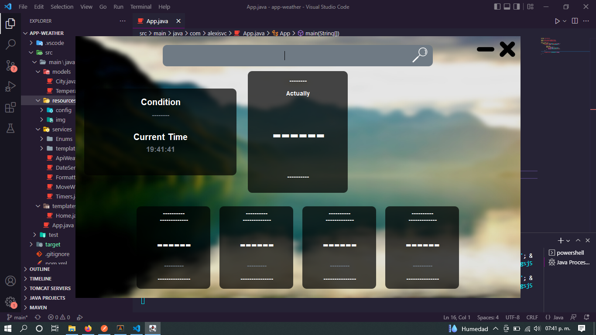
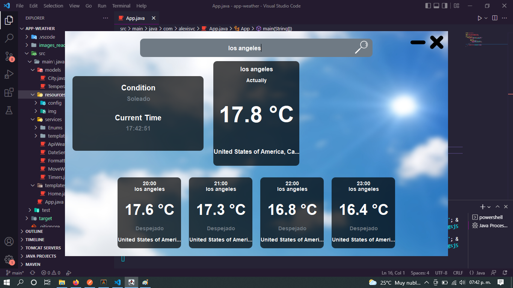
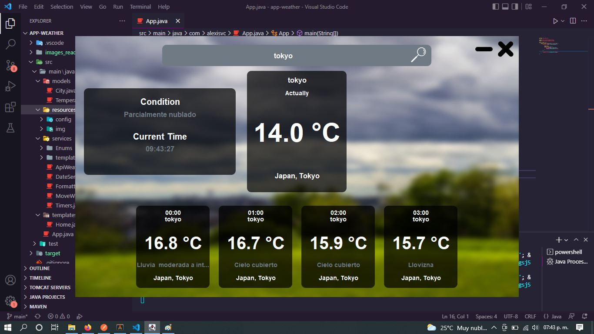
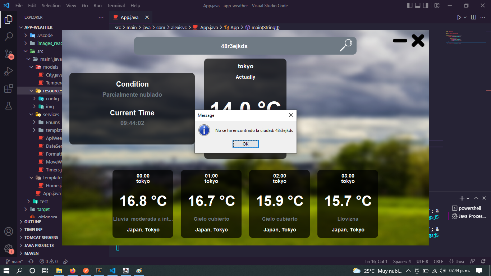

# app-weather
This is a app that show you the current and future weather for a city entered, for this app we only use:
* The jackson library (For manipulate JSON of the response of requests).
* The API of 'Weather API Free' (https://www.weatherapi.com/).

# Desmotration of the app in operation:
## App Init:

## Searching city weather:

## Error if city not found:

